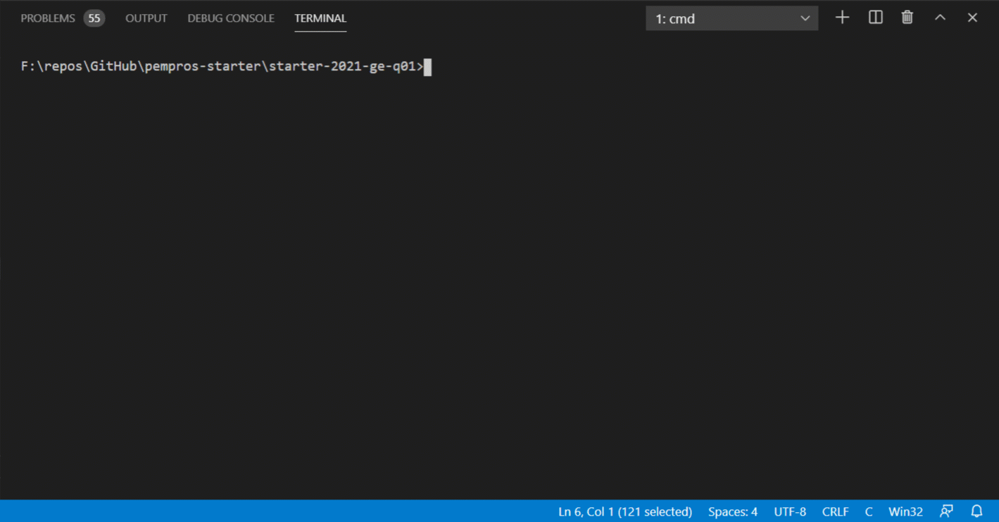

## Quiz 1
Pada tugas kali ini anda akan mengembangkan sebuah program sederhana yang akan digunakan untuk memanajemen kuangan pribadi. Tugas ini merangkum seluruh topik yang disajikan pada paruh pertama perkuliahan.

### Hemat Pangkal Kaya, Cermat Pangkal Selamat
Ucok dan Butet, sahabat selamanya, mengalami persoalan yang sama yaitu sulit memanajemen keuangan. Sudah empat bulan terakhir Ucok dan Butet selalu mengalami defisit anggaran. Sebagai mahasiswa, Ucok dan Butet diberikan "gaji" oleh orang tua mereka yang harus cukup untuk satu bulan. Defisit dimaksud adalah ketika uang bulanan tidak mencukupi sehingga mereka perlu mengeluarkan dana tambahan dari tabungan mereka.

Hal pertama yang harus dilakukan adalah mencatat semua income (pendapatan) dan expense (pengeluaran) yang terjadi dalam satu bulan. Dari sana kemudian dapat diidentifikasi penyebab defisit serta dilakukan tindakan pencegahannya.

Ucok dan Butet kemudian ingin mengembangkan suatu aplikasi yang akan membantu mereka dalam mencatat semua transaksi yang dilakukan, baik income maupun expense. Aplikasi kemudian akan menampilkan total income dan total expense dalam sebulan serta memberi simpulan apakah terjadi surplus, deficit, atau balanced.

Berikut rancangan aplikasinya:
1. Pada saat dieksekusi, program akan membaca satu argumen tambahan yang menunjukkan jumlah transaksi (```t```) yang akan ditangani, di mana ```0 < t <= 10```.
2. Selanjutnya program akan membaca ```t``` buah baris transaksi. Setiap baris transaksi mencantumkan informasi ```tipe``` transaksi, ```nama``` transaksi, dan ```nilai``` yang dikeluarkan. Informasi diseparasi dengan sebuah ```#```. Panjang sebaris teks transaksi tidak lebih dari 100 karakter. Selain itu, dijamin ```nilai``` transaksi adalah bilangan bulat, ```nilai < 500```.
3. Setelah semua baris transaksi dimasukkan, program kemudian akan menampilkan semua transaksi dengan tipe ```income``` kemudian diikuti dengan menampilkan semua transaksi dengan tipe ```expense``` berurut dari yang lebih dahulu dimasukkan. Setiap baris keluaran menampilkan ```nama``` transaksi, ```nilai``` transaksi, dan ```jenis``` transaksi.
4. Selanjutnya, aplikasi akan menampilkan total income dan total expense yang diseparasi dengan sebuah semicolon (```;```) dalam satu baris keluaran.
5. Terakhir, aplikasi akan menampilkan kesimpulan dalam sebaris keluaran. Kesimpulan ```surplus``` diberikan ketika total income lebih besar daripada total expense, ```deficit``` jika yang terjadi adalah sebaliknya, dan ```balanced``` jika total income sama dengan total expense.

#### Implementation requirements
Definisikan sebuah struct yang akan menampung informasi terkait transaksi, seperti ```nama```, ```nilai```, dan ```tipe``` transaksi.

#### Example 1
Input dengan ```1``` sebagai additional argument pada saat eksekusi.
```
expense#200#beli pulsa

```
Output
```
beli pulsa;200;expense
0 200
deficit

```

#### Example 2
Input dengan ```5``` sebagai additional argument pada saat eksekusi.
```
income#250#gajian
expense#100#beli pulsa
expense#50#sputivi
expense#100#investasi akhirat
expense#70#beli flashdisk

```
Output
```
gajian;250;income
beli pulsa;100;expense
sputivi;50;expense
investasi akhirat;100;expense
beli flashdisk;70;expense
250 320
deficit

```

#### Example 3
Input dengan ```6``` sebagai additional argument pada saat eksekusi.
```
income#250#gajian
expense#100#beli pulsa
expense#50#sputivi
income#100#hibah dari opung
expense#100#investasi akhirat
expense#70#beli flashdisk

```
Output
```
gajian;250;income
hibah dari opung;100;income
beli pulsa;100;expense
sputivi;50;expense
investasi akhirat;100;expense
beli flashdisk;70;expense
350 320
surplus

```



## Submission
1. q01_01.c
2. changelog.txt

## How to submit?
Please see https://youtu.be/g0BQ195-aWo